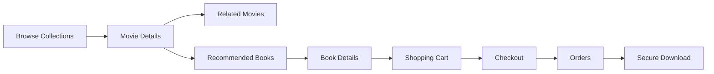
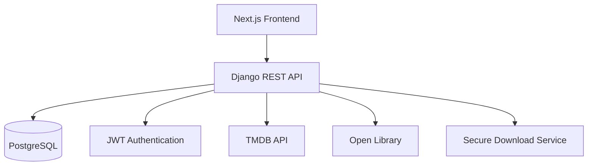

# 🎬 PolyMath

<p align="center">
  
</p>

<div align="center">

### Discover Movies. Explore Universes. Build Your Digital Library.

### Full-Stack Movie Explorer • Digital Book Marketplace • JWT Authentication • Secure Downloads

**Live Demo:** _Add your Vercel URL_ &nbsp; • &nbsp; **API Docs:** _Add your Railway URL_

</div>

---

# 🎥 Product Walkthrough

<p align="center">

### 🎬 PolyMath Demo

> Add your demo video or GIF here.

</p>

---

# 🚀 Why PolyMath?

PolyMath is a dual-purpose platform that combines a curated cinematic universe explorer with a digital knowledge marketplace.

The platform features **250+ movies and TV series** across **25 carefully curated cinematic universes**, allowing users to browse franchises, discover related titles, and explore detailed movie information.

Alongside the cinema explorer is a fully functional digital bookstore where users can browse, purchase, and securely download digital books through a complete e-commerce workflow.

Built using **Django REST Framework** and **Next.js**, PolyMath demonstrates full-stack application development, authentication, third-party API integration, secure file delivery, and responsive UI design.

---

# ✨ Features

## 🎬 Cinema Explorer

- Browse 25 curated cinematic universes
- Explore 250+ movies and TV series
- Collection pages with sorting and filtering
- Detailed movie information
- Related movie recommendations
- Related book recommendations
- Self-healing poster & banner images
- Responsive Netflix-inspired browsing experience

---

## 📚 Knowledge Marketplace

- Browse digital books
- Search and filter books
- Shopping cart
- Secure checkout
- Order history
- Order cancellation
- Secure UUID-based downloads
- Consistent icon-based book covers

---

## 🔐 Platform

- JWT Authentication
- Refresh Token Authentication
- Customer, Vendor & Admin roles
- Dark animated UI
- Responsive design
- RESTful API architecture

---

# 🔄 User Flow



---

# 🏗 Architecture



---

# 📸 Screenshots

## 🏠 Home Page

> Landing page showcasing featured cinematic universes and books.

<p align="center">
  
</p>

---

## 🎬 Cinematic Collections

> Browse 25 curated cinematic universes.

<p align="center">
  
</p>

---

## 🎥 Movie Details

> View movie information, ratings, metadata, related titles, and recommended books.

<p align="center">
  
</p>

---

## 📚 Book Marketplace

> Browse and search digital books.

<p align="center">
  
</p>

---

## 📖 Book Details

> View book information before purchasing.

<p align="center">
  
</p>

---

## 🛒 Shopping Cart

> Manage cart items before checkout.

<p align="center">
  
</p>

---

## 💳 Checkout

> Secure checkout experience.

<p align="center">
  
</p>

---

## 📦 Orders

> View purchased books and download them securely.

<p align="center">
  
</p>

---

# 💻 Tech Stack

### Frontend

- Next.js 16
- React
- TypeScript

### Backend

- Django 6
- Django REST Framework
- SimpleJWT

### Database

- PostgreSQL
- SQLite (Development)

### External APIs

- TMDB
- Open Library

### Deployment

- Vercel
- Railway

### Testing

- pytest
- pytest-django
- factory_boy

---

# 📂 Project Structure

```text
PolyMath
│
├── frontend
│
├── backend
│
├── docs
│   ├── assets
│   └── screenshots
│
└── README.md
```

---

# 🚀 Quick Start

## Clone Repository

```bash
git clone https://github.com/Abhay-SKulkarni123/PolyMath.git

cd PolyMath
```

---

## Backend Setup

```bash
cd backend

python -m venv venv

source venv/bin/activate      # Windows: venv\Scripts\activate

pip install -r requirements.txt

cp .env.example .env

python manage.py migrate

python manage.py seed_cinema

python manage.py runserver
```

---

## Frontend Setup

```bash
cd frontend

npm install

cp .env.local.example .env.local

npm run dev
```

Visit:

```text
http://localhost:3000
```

---

## Running Tests

```bash
cd backend

pytest --cov=.
```

---

# ⚠ Known Limitations

- A small number of TMDB titles permanently lack artwork and display placeholder images.
- Book covers intentionally use icon-based placeholders for a consistent UI.
- Recommendation system is currently rule-based.

---

# 🚀 Future Improvements

- AI-powered recommendation engine
- Personalized watchlists
- Background synchronization for TMDB assets
- Elasticsearch-powered search
- Payment gateway integration
- Increased automated test coverage
- Component-based UI library

---

# 🌱 What I Learned

Building PolyMath strengthened my understanding of:

- Full-Stack Application Development
- REST API Design
- JWT Authentication
- Database Modeling
- Secure File Delivery
- Third-Party API Integration
- Production Deployment
- Responsive UI Development
- Building resilient systems around external APIs

---

# 🔗 Links

### 🌐 Live Application

_Add your Vercel URL_

### ⚙ Backend API

_Add your Railway URL_

### 📂 GitHub Repository

https://github.com/Abhay-SKulkarni123/PolyMath

---

<div align="center">

### Built with ❤️ by A S K

</div>